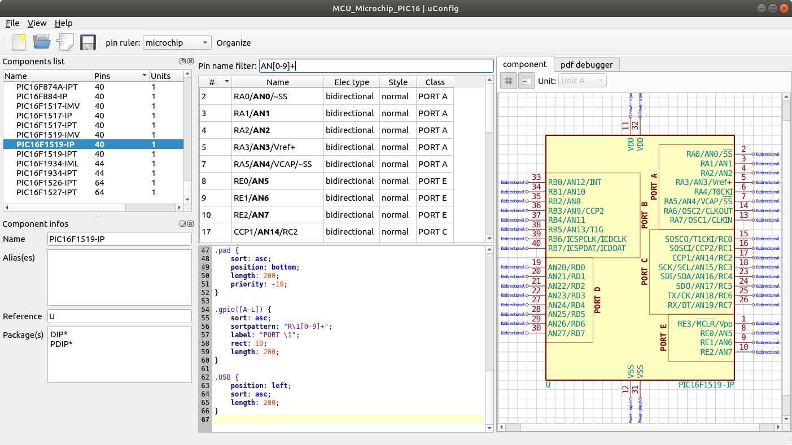
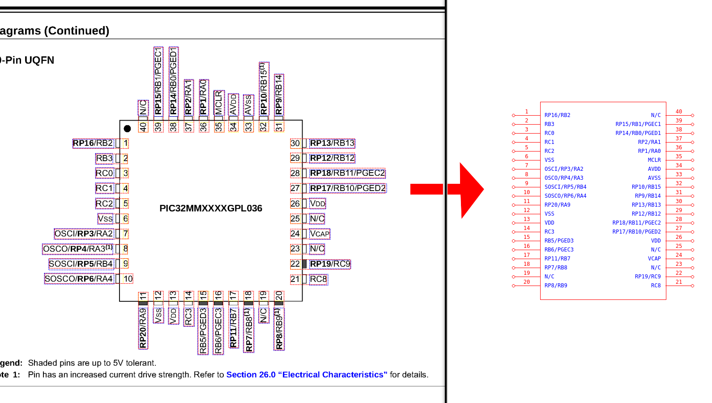

# uConfig

[](http://www.gnu.org/licenses/gpl-3.0)
[](https://travis-ci.org/Robotips/uConfig)
[](https://ci.appveyor.com/project/sebcaux/uconfig)

[](https://snapcraft.io/uconfig)

An old personal project resurrected to extract pinout from PDF datasheet and create Kicad schematics.



Directly save Kicad library files. Work better with huge number of pins.

## PDF extraction, how does it work ?

The extraction of pin mapping from PDF files is done by parsing datasheet. Poppler is used to extract blocks of text and with magic rules,
it sorts the pin numbers and pin labels. Labels and numbers are associated by most relevant pair to create pins. Then, the list of pins is
also sorted and associated by packages. This list of package could be save as a kicad library.



The second part of the tool is named `pinruler`, to permit a reorganization following a set of rules named `KSS` (Kicad Style Sheet).
KSS files are similar to CSS files, take a look to [KSS reference variables](rules/README.md).

It exists a command line tool to extract components from a datasheet :

```bash
uconfig datasheet.pdf -o lib1.lib -r microchip.kss
```

It will be save in `lib1.lib` all the schematics of components found in `datasheet.pdf` formated with the `microchip.kss` KSS file rules.

A GUI interface is also available, called uconfig_gui.

## KSS, Kicad Style Sheet

An innovative way to define a theme for a schematic component inspired from CSS. This could be compare to a
kicad library linter. You can find examples in rules/ directory or take a look to [KSS reference variables](rules/README.md).

## TODO

- CSV importer
- multi-pages components
- BGA footprint

## Bugs

If any component extraction does not work, send an issue in [issues](https://github.com/Robotips/uConfig/issues)
and give the link to the datasheet and page of the rebel component.

## Binaries downloads

For convenience, a pre-built project is available at :

https://ci.appveyor.com/api/projects/sebcaux/uconfig/artifacts/uconfig-win32-v0.zip

## Dependencies and building
### Qt5

uConfig use Qt5 C++ Framework. Version 5.2 is the minimal supported.

To know your Qt version :

```bash
qmake -query QT_VERSION
```

To install on Ubuntu (or Debian):

```bash
sudo apt install qt5-default qttools5-dev-tools
```

### poppler

poppler is a pdf parser library under GPL v3 license. v0.41 is the minimal supported with qt5 frontend.

To install on Ubuntu (or Debian):

```bash
sudo apt install libpoppler-qt5-dev
```

For windows, build from sources (very annoying) or find a built version here :

- includes : [http://robotips.fr/data/bin-poppler-win32.tar.gz](http://robotips.fr/data/bin-poppler-win32.tar.gz) (uncompress to uconfig/bin/)
- DLLs : [http://robotips.fr/data/include-poppler.tar.gz](http://robotips.fr/data/include-poppler.tar.gz) (uncompress to uconfig/)

### github source checkout
make sure you checkout as well the submodules, for example like this:

```
git clone https://github.com/Robotips/uConfig.git
cd uConfig
git submodule init
git submodule update
```

### build

```bash
cd uConfig
mkdir build
cd build
qmake ../src/uConfig.pro
make -j4
```

### build on macOS

```bash
brew install qt
brew install poppler
cd uConfig
mkdir build
cd build
qmake ../src/uConfig.pro
make -j4
cd ../bin
macdeployqt uconfig_gui.app -libpath=./
# the uconfig_gui.app can the easily be started as a normal mac application
```
